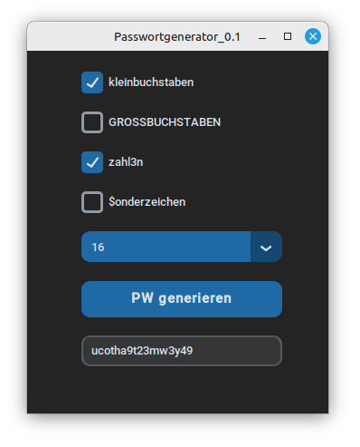

# Moderner Password Generator (OOP-Demo)

Ein moderner Passwortgenerator mit einer grafischen Oberfläche, gebaut mit **Python** und **CustomTkinter**.



## Hintergrund & Ziel dieses Projekts

**Ich habe dieses Projekt von Grund auf selbst entwickelt und gestaltet.** Mein Ziel war es, ein anschauliches und leicht verständliches Praxisbeispiel zu schaffen, um meinen Kurs-Teilnehmern die Grundlagen der **Objektorientierten Programmierung (OOP)** näherzubringen. 

Besonders wichtig war mir dabei zu zeigen, wie man **theoretische OOP-Konzepte direkt mit einer modernen grafischen Oberfläche (GUI) verbindet**, ohne dass der Code unübersichtlich wird.

Anhand dieses Projekts erkläre ich:
* **Saubere Trennung (MVC-Ansatz):** Wie die reine Passwort-Logik (`logik.py`) und die Benutzeroberfläche (`dark-optik.py`) als getrennte Klassen agieren und miteinander kommunizieren.
* **Intelligente Getter (`@property`):** Wie die GUI Daten abrufen kann und die Logik-Klasse im Hintergrund vollautomatisch das Auffüllen und Mischen übernimmt (Lazy Evaluation).

## Installation & Start

1. **Abhängigkeiten installieren:**
   ```bash
   pip install customtkinter
   ```

2. **Programm starten:**
   Führe die Hauptdatei der Oberfläche aus:
   ```bash
   python3 dark-optik.py
   ```

## Verwendete Technologien
* **Python 3**
* **CustomTkinter** (für das moderne UI-Design)
* **secrets** (kryptografisch sichere Zufallswerte aus der Python-Standardbibliothek)

---
